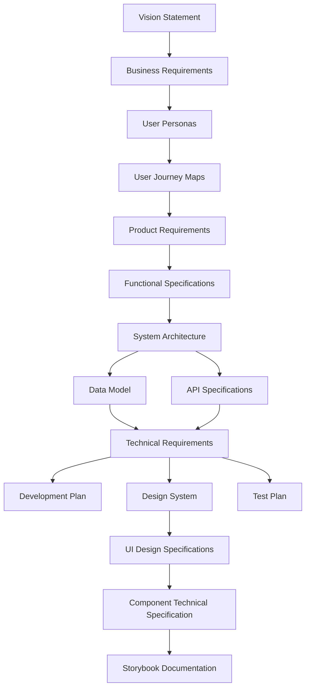

# Software Specification Prompts

This repository contains a collection of specialized prompts designed to generate comprehensive software specification documents for your project. When used in sequence, these prompts will guide you through creating a complete set of documentation from vision statement to development plan.

## Overview

The specification prompts system helps you create professional software documentation by:

1. Breaking down the documentation process into logical steps
2. Ensuring each document builds on previous ones
3. Maintaining consistency across all specifications
4. Providing clear templates for each document type

## Document Flow

The prompts should be executed in the following order to ensure proper dependencies are maintained:



## Dependencies and Required Inputs

Each prompt relies on specific information from previous documents. Here's a breakdown of each prompt, its dependencies, and the user input required:

### 1. Vision Statement (`vision-statement-prompt.md`)
- **Dependencies**: None (Starting point)
- **Required User Input**: 
  - Project title
  - High-level vision instructions
  - Target audience
  - Problem statement
  - Core value proposition

### 2. Business Requirements Document (`brd-prompt.md`)
- **Dependencies**: Vision Statement
- **Required User Input**:
  - Business objectives
  - Stakeholder information
  - Success criteria
  - Budget and timeline constraints
  - Market analysis information

### 3. User Personas (`user-personas-prompt.md`)
- **Dependencies**: Vision Statement, BRD
- **Required User Input**:
  - Target user demographics
  - User goals and pain points
  - Behavioral patterns
  - Technical proficiency

### 4. User Journey Maps (`user-journey-maps-prompt.md`)
- **Dependencies**: Vision Statement, BRD, User Personas
- **Required User Input**:
  - Key user scenarios
  - Touchpoints
  - User emotions and pain points during interaction
  - Critical user paths

### 5. Product Requirements Document (`prd-prompt.md`)
- **Dependencies**: Vision Statement, BRD, User Personas, User Journey Maps
- **Required User Input**:
  - Feature specifications
  - User stories
  - Prioritization guidelines
  - Success metrics
  - Technical constraints

### 6. Functional Specification Document (`fsd-prompt.md`)
- **Dependencies**: Vision Statement, BRD, PRD
- **Required User Input**:
  - Detailed functional requirements
  - System behavior specifications
  - Business rules
  - Workflow descriptions

### 7. System Architecture Document (`system-architecture-prompt.md`)
- **Dependencies**: Vision Statement, BRD, PRD, FSD
- **Required User Input**:
  - Technology stack preferences
  - Scaling requirements
  - Integration points
  - Security requirements
  - Performance criteria

### 8. Data Model Document (`data-model-prompt.md`)
- **Dependencies**: FSD, System Architecture
- **Required User Input**:
  - Entity relationships
  - Data storage requirements
  - Data validation rules
  - Regulatory compliance needs

### 9. API Specifications (`api-specifications-prompt.md`)
- **Dependencies**: System Architecture, Data Model
- **Required User Input**:
  - API requirements
  - Authentication mechanisms
  - Endpoint structures
  - Request/response formats

### 10. Technical Requirements Document (`technical-requirements-prompt.md`)
- **Dependencies**: FSD, System Architecture, Data Model, API Specifications
- **Required User Input**:
  - Performance requirements
  - Security requirements
  - Scalability needs
  - Compatibility requirements
  - Testing criteria

### 11. Development Plan (`development-plan-prompt.md`)
- **Dependencies**: All previous documents
- **Required User Input**:
  - Team structure
  - Development methodology
  - Timeline constraints
  - Resource allocation
  - Risk factors

### 12. Design System Document (`design-system-prompt.md`)
- **Dependencies**: Vision Statement, BRD, User Personas, PRD
- **Required User Input**:
  - Design principles
  - Brand attributes
  - Color palette specifications
  - Typography guidelines
  - Spacing and layout preferences
  - Component design guidelines
  - Accessibility requirements

### 13. UI Design Specifications (`ui-design-specifications-prompt.md`)
- **Dependencies**: Vision Statement, User Personas, User Journey Maps, PRD, Design System
- **Required User Input**:
  - Screen design requirements
  - Interaction patterns
  - Responsive design guidelines
  - State handling (loading, error, empty states)
  - Animation and transition specifications
  - Implementation priorities

### 14. Component Technical Specification (`component-technical-specification-prompt.md`)
- **Dependencies**: Design System, UI Design Specifications, System Architecture
- **Required User Input**:
  - Component API design preferences
  - State management approach
  - Accessibility implementation requirements
  - Testing strategy for components
  - Performance optimization requirements
  - Component documentation standards

### 15. Storybook Documentation (`storybook-prompt.md`)
- **Dependencies**: Design System, UI Design Specifications, Component Technical Specification
- **Required User Input**:
  - Storybook organization preferences
  - Component demonstration requirements
  - Documentation standards
  - Testing integration approach
  - Example story requirements

### 16. Test Plan (`test-plan-prompt.md`)
- **Dependencies**: FSD, Technical Requirements, UI Design Specifications, Component Technical Specification
- **Required User Input**:
  - Testing scope and objectives
  - Test environment requirements
  - Test data specifications
  - Test automation approach
  - Performance testing criteria
  - Security testing requirements
  - Acceptance criteria

## Usage Instructions

1. **Create the `/specifications` directory** in your project root (if it doesn't exist already)
   ```
   mkdir -p specifications
   ```

2. **Initialize the progress tracking file**
   ```
   touch progress.md
   ```

3. **Follow the document flow** outlined above, starting with the Vision Statement and proceeding in order

4. **For each prompt**:
   - Review the prompt file to understand its requirements
   - Gather the required user input
   - Generate the document using the prompt
   - Save the output to the `/specifications` directory with the appropriate filename
   - Update the progress.md file

## Maintaining the Progress.md File

The progress.md file helps you track your documentation progress. Update it after completing each document with the following information:

1. Check the box for the completed document
2. Add the completion date
3. Update the "Current Status" section
4. Update the "Next Steps" section
5. Add any relevant notes or decisions made

## Notes

- All documents are generated in Markdown format
- Each document builds upon previous ones, so maintain the recommended sequence
- Store all generated documents in the `/specifications` directory for proper cross-referencing
- The prompts are designed to work with the Claude AI assistant

## Example Workflow

1. Start by reviewing the vision-statement-prompt.md
2. Provide the required inputs for your Vision Statement
3. Generate the Vision.md document and save it to /specifications/
4. Update progress.md to mark Vision Statement as complete
5. Proceed to the BRD prompt, referring to your completed Vision Statement
6. Continue through each document in sequence

By following this structured approach, you'll create a comprehensive set of software specification documents that maintain consistency and traceability throughout your project.
