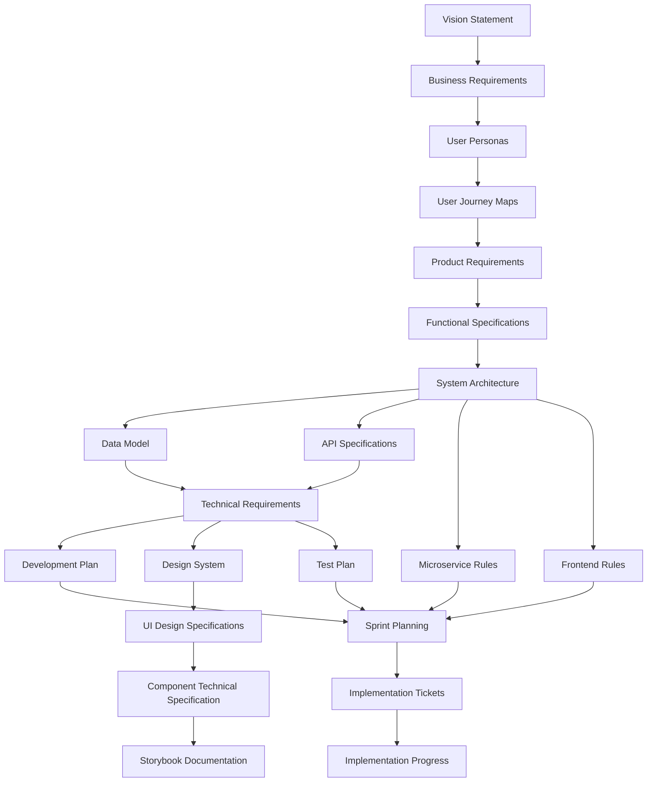

# Yoga Schedule Manager - Project Documentation

This repository contains the comprehensive documentation for the Yoga Schedule Manager application. It follows a structured approach to software specification, from vision statement to implementation details.

## Overview

The Yoga Schedule Manager will help yoga studios and independent teachers manage their class schedules, student registrations, and business operations. This documentation repository:

1. Breaking down the development process into logical documentation steps
2. Ensuring each document builds on previous ones for consistency
3. Maintaining traceability from business requirements to technical implementation
4. Providing clear specifications for all aspects of the application
5. Organizing implementation into sequential sprints and detailed tickets

## Document Flow

The prompts should be executed in the following order to ensure proper dependencies are maintained:



## Dependencies and Required Inputs

Each prompt relies on specific information from previous documents. Here's a breakdown of each prompt, its dependencies, and the user input required:

### 1. Vision Statement (`vision-statement-prompt.md`)
- **Dependencies**: None (Starting point)
- **Required User Input**: 
  - Project title
  - High-level vision instructions
  - Target audience
  - Problem statement
  - Core value proposition

### 2. Business Requirements Document (`brd-prompt.md`)
- **Dependencies**: Vision Statement
- **Required User Input**:
  - Business objectives
  - Stakeholder information
  - Success criteria
  - Budget and timeline constraints
  - Market analysis information

### 3. User Personas (`user-personas-prompt.md`)
- **Dependencies**: Vision Statement, BRD
- **Required User Input**:
  - Target user demographics
  - User goals and pain points
  - Behavioral patterns
  - Technical proficiency

### 4. User Journey Maps (`user-journey-maps-prompt.md`)
- **Dependencies**: Vision Statement, BRD, User Personas
- **Required User Input**:
  - Key user scenarios
  - Touchpoints
  - User emotions and pain points during interaction
  - Critical user paths

### 5. Product Requirements Document (`prd-prompt.md`)
- **Dependencies**: Vision Statement, BRD, User Personas, User Journey Maps
- **Required User Input**:
  - Feature specifications
  - User stories
  - Prioritization guidelines
  - Success metrics
  - Technical constraints

### 6. Functional Specification Document (`fsd-prompt.md`)
- **Dependencies**: Vision Statement, BRD, PRD
- **Required User Input**:
  - Detailed functional requirements
  - System behavior specifications
  - Business rules
  - Workflow descriptions

### 7. System Architecture Document (`system-architecture-prompt.md`)
- **Dependencies**: Vision Statement, BRD, PRD, FSD
- **Required User Input**:
  - Technology stack preferences
  - Scaling requirements
  - Integration points
  - Security requirements
  - Performance criteria

### 8. Data Model Document (`data-model-prompt.md`)
- **Dependencies**: FSD, System Architecture
- **Required User Input**:
  - Entity relationships
  - Data storage requirements
  - Data validation rules
  - Regulatory compliance needs

### 9. API Specifications (`api-specifications-prompt.md`)
- **Dependencies**: System Architecture, Data Model
- **Required User Input**:
  - API requirements
  - Authentication mechanisms
  - Endpoint structures
  - Request/response formats

### 10. Technical Requirements Document (`technical-requirements-prompt.md`)
- **Dependencies**: FSD, System Architecture, Data Model, API Specifications
- **Required User Input**:
  - Performance requirements
  - Security requirements
  - Scalability needs
  - Compatibility requirements
  - Testing criteria

### 11. Development Plan (`development-plan-prompt.md`)
- **Dependencies**: All previous documents
- **Required User Input**:
  - Team structure
  - Development methodology
  - Timeline constraints
  - Resource allocation
  - Risk factors

### 12. Design System Document (`design-system-prompt.md`)
- **Dependencies**: Vision Statement, BRD, User Personas, PRD
- **Required User Input**:
  - Design principles
  - Brand attributes
  - Color palette specifications
  - Typography guidelines
  - Spacing and layout preferences
  - Component design guidelines
  - Accessibility requirements

### 13. UI Design Specifications (`ui-design-specifications-prompt.md`)
- **Dependencies**: Vision Statement, User Personas, User Journey Maps, PRD, Design System
- **Required User Input**:
  - Screen design requirements
  - Interaction patterns
  - Responsive design guidelines
  - State handling (loading, error, empty states)
  - Animation and transition specifications
  - Implementation priorities

### 14. Component Technical Specification (`component-technical-specification-prompt.md`)
- **Dependencies**: Design System, UI Design Specifications, System Architecture
- **Required User Input**:
  - Component API design preferences
  - State management approach
  - Accessibility implementation requirements
  - Testing strategy for components
  - Performance optimization requirements
  - Component documentation standards

### 15. Storybook Documentation (`storybook-prompt.md`)
- **Dependencies**: Design System, UI Design Specifications, Component Technical Specification
- **Required User Input**:
  - Storybook organization preferences
  - Component demonstration requirements
  - Documentation standards
  - Testing integration approach
  - Example story requirements

### 16. Test Plan (`test-plan-prompt.md`)
- **Dependencies**: FSD, Technical Requirements, UI Design Specifications, Component Technical Specification
- **Required User Input**:
  - Testing scope and objectives
  - Test environment requirements
  - Test data specifications
  - Test automation approach
  - Performance testing criteria
  - Security testing requirements
  - Acceptance criteria

### 17. Microservice Rules (`microservice-rules-prompt.md`)
- **Dependencies**: System Architecture, Technical Requirements, API Specifications, Data Model
- **Required User Input**:
  - Technology stack details from System Architecture
  - API standards and requirements
  - Performance requirements
  - Security requirements
  - Organizational coding standards
  - Team experience level with selected technologies
  - Target deployment environment details
  - Monitoring and observability requirements

### 18. Frontend Rules (`frontend-rules-prompt.md`)
- **Dependencies**: System Architecture, Technical Requirements, Design System, UI Design Specifications, Component Technical Specification
- **Required User Input**:
  - UI framework/library details
  - State management approach
  - Design system information
  - Component architecture requirements
  - Performance requirements
  - Accessibility requirements
  - Browser/device support requirements
  - Organizational coding standards

### 19. Sprint Planning (`sprint-planning-prompt.md`)
- **Dependencies**: Development Plan, Test Plan, Microservice Rules, Frontend Rules
- **Required User Input**:
  - Project title and brief description
  - Overall timeline constraints
  - Team composition and skills
  - Development methodology preference
  - Sprint duration preference
  - Desired velocity or work capacity per sprint
  - Prioritization criteria
  - Location of specification documents

### 20. Implementation Tickets (`ticket-template.md`)
- **Dependencies**: Sprint Planning
- **Required User Input**:
  - Ticket title and description
  - Priority and effort estimation
  - Acceptance criteria
  - Dependencies on other tickets
  - Technical references to specification documents
  - Implementation notes and guidelines

### 21. Implementation Progress Tracking (`sprint-progress-template.md`)
- **Dependencies**: Sprint Planning, Implementation Tickets
- **Required User Input**:
  - Sprint status updates
  - Completed features
  - Current work status
  - Blockers and risks
  - Implementation metrics
  - Architectural decisions
  - Retrospective insights

## Usage Instructions

### Documentation Phase

1. **Create the `/specifications` directory** in your project root (if it doesn't exist already)
   ```
   mkdir -p specifications
   ```

2. **Initialize the documentation progress tracking file**
   ```
   touch progress.md
   ```

3. **Follow the document flow** outlined above, starting with the Vision Statement and proceeding in order

4. **For each documentation prompt**:
   - Review the prompt file to understand its requirements
   - Gather the required user input
   - Generate the document using the prompt
   - Save the output to the `/specifications` directory with the appropriate filename
   - Update the progress.md file

### Development Standards Phase

1. **Create development standards documents** after completing the system architecture
   - Use the microservice-rules-prompt.md to create microservice development standards
   - Use the frontend-rules-prompt.md to create frontend development standards
   
2. **For each standards document**:
   - Reference the appropriate specification documents (System Architecture, Technical Requirements, etc.)
   - Ensure standards align with architectural decisions
   - Create concrete examples of proper implementation
   - Save the output to the `/specifications` directory with the appropriate filename
   - Update the progress.md file

### Implementation Planning Phase

1. **Create the `/sprints` directory** in your project root
   ```
   mkdir -p sprints
   ```

2. **Initialize the implementation progress tracking file**
   ```
   touch sprints/progress.md
   ```

3. **Create sprint planning document** using the sprint-planning-prompt.md
   - Review all specification documents
   - Identify logical development phases
   - Define sprint objectives and timeframes

4. **Create sprint subdirectories** for each planned sprint
   ```
   mkdir -p sprints/sprint_01
   mkdir -p sprints/sprint_02
   # etc.
   ```

5. **Create implementation tickets** in each sprint directory
   - Use the ticket-template.md as a guide
   - Follow the naming convention: ticket_sprint01_ticket01.md
   - Ensure dependencies between tickets are clearly documented
   - Reference relevant specification documents

6. **Maintain the implementation progress tracking file** (sprints/progress.md)
   - Update after each sprint
   - Track completed features
   - Document architectural decisions
   - Note blockers and risks

## Maintaining Progress Files

### Documentation Progress (progress.md)

The documentation progress file helps you track your specification document creation. Update it after completing each document with the following information:

1. Check the box for the completed document
2. Add the completion date
3. Update the "Current Status" section
4. Update the "Next Steps" section
5. Add any relevant notes or decisions made

### Implementation Progress (sprints/progress.md)

The implementation progress file tracks the actual development of the project. Update it after each sprint with:

1. Update the "Sprint Status" section with completed sprints and achievements
2. Update the "Current Sprint" section with objectives and progress
3. Document completed features with references to specification documents
4. Track current work with ticket IDs and statuses
5. Note any blockers, risks, or architectural decisions
6. Update implementation metrics (velocity, test coverage, etc.)
7. Capture retrospective insights for continuous improvement

## Notes

- All documents are generated in Markdown format
- Each document builds upon previous ones, so maintain the recommended sequence
- Store all generated documents in the `/specifications` directory for proper cross-referencing
- The prompts are designed to work with the Claude AI assistant

## Example Workflow

### Documentation Workflow

1. Start by reviewing the vision-statement-prompt.md
2. Provide the required inputs for your Vision Statement
3. Generate the Vision.md document and save it to /specifications/
4. Update progress.md to mark Vision Statement as complete
5. Proceed to the BRD prompt, referring to your completed Vision Statement
6. Continue through each document in sequence until you have a complete set of specification documents

### Implementation Planning Workflow

1. After completing all specification documents, use the sprint-planning-prompt.md to create a sprint plan
2. Break down the project into logical sprints based on dependencies and complexity
3. Create sprint folders and individual implementation tickets for each sprint
4. For each ticket:
   - Include clear references to specification documents
   - Define acceptance criteria based on specs
   - Document dependencies on other tickets
5. Begin implementation tracking as development starts
6. Update the sprints/progress.md file after each sprint

By following this structured approach, you'll create a comprehensive set of software specification documents and a well-organized implementation plan that maintains consistency and traceability throughout your project's lifecycle.
